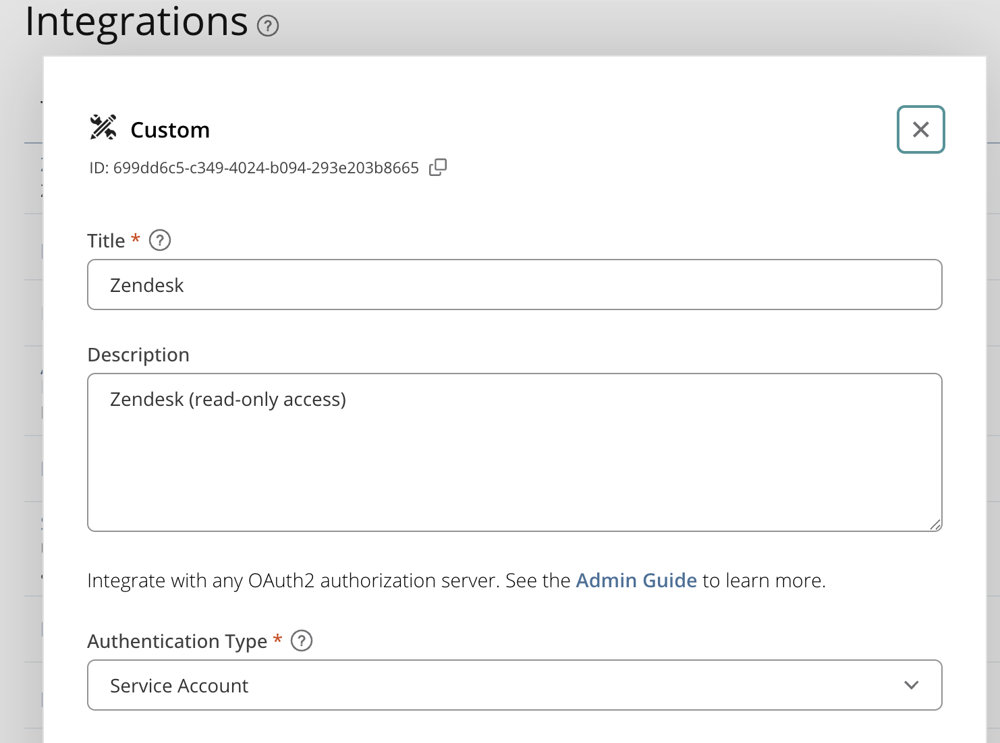
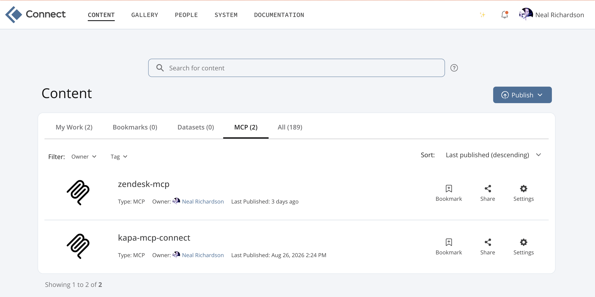
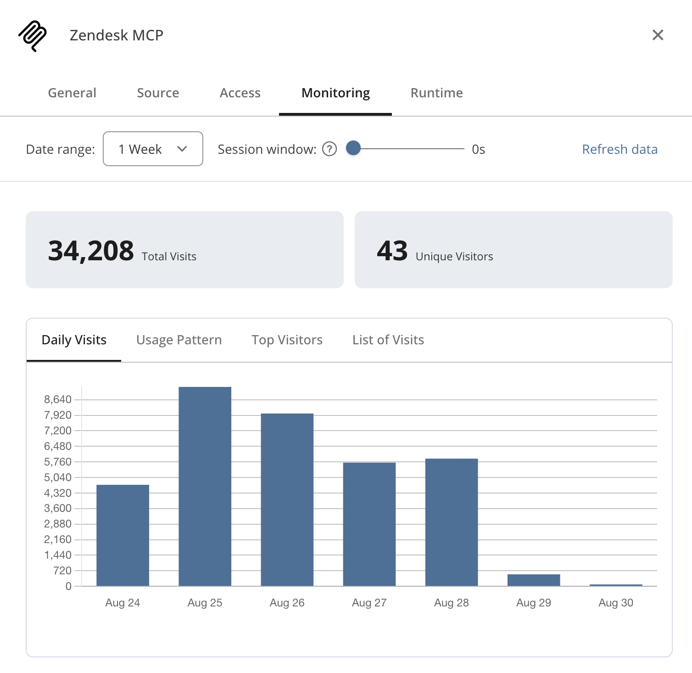

## {.titlepage}

::: {.tp}
<p class="tp-line1">A WITTIE</p>
<p class="tp-line2">AND PLEASANT</p>
<p class="tp-line3">COMEDIE</p>
<p class="tp-called">Called</p>
<p class="tp-play">MCP, or not MCP?</p>
<p class="tp-note">Miſplac'd among the Tragedies.</p>
<p class="tp-cast">As it is to be acted at the poſit::conf and in the Cloud.</p>
<p class="tp-author">VVritten by NEAL RICHARDSON.</p>
<p class="tp-imprint"><span class="tp-place">Houston</span>,<br>Printed for the Author, and are to be had at<br><em>enpiar.com/mcp-posit-conf-2026</em></p>
<p class="tp-year">2026.</p>
:::

::: {.notes}
Friends, Romans, countrymen, lend me your ears!

I'm here today to talk to you about MCP: what it is, what it's good for, and how best to use it. 

I want to start with a story about how I learned what MCP was for. 
:::

## Act I {.center}

::: {.notes}
Two houses, both alike in dignity, in fair Posit where we make our scene
:::

## {background-image="img/diptych-1.jpeg"}

::: {.notes}
One one side, we have the Posit engineering team, where I work.
On the other, our users, our customers.

Now, these are not rival clans, but fate, or technology, has conspired to keep them apart.

Posit's enterprise products run on-premises, which means that if something goes wrong, or if a product user wants to request an feature, the engineers can't see what's going on directly.
:::

## {background-image="img/diptych-2.jpeg"}

::: {.notes}
The user needs to write a everything down in a support ticket and send it to us. Then the engineers need to try to reconstruct what happened from that information, dig through the code base, and try to understand. 
:::

## {background-image="img/balthasar-1.jpeg"}

::: {.notes}

Posit uses Zendesk for support, customers can file tickets there and they get fielded by our support team. When they get a clear bug report, or something that they can't answer on their own, it escalates to the engineers. 
:::

## {background-image="img/balthasar-2.jpeg"}

::: {.notes}

By the time the engineers get it, the ticket can be quite long, lots of back and forth, and there can be large attachments with diagnostic data in them. 

By the end of last year, engineering was heavily using AI for lots of things, and one thing we found that models like Claude were good at was reading the codebase, developing an understanding of how it works, and pinpointing bugs. But to use it for support issues, we first had to do all of the analysis of the ticket discussion and diagnostics, and that can be a lot of work. 

I thought, how can I just plug Zendesk into Claude and let it figure it out?

I want to just take the ticket URL and give it to Claude Code like this:
:::

##

```
 ▐▛███▜▌   Claude Code v2.1.158
▝▜█████▛▘  Opus 5 (1M context) · Claude Enterprise
  ▘▘ ▝▝    ~/code


❯ I prithee, friend, bestow thy help with https://posit.zendesk.com/agent/tickets/129426

```

::: {.notes}
However, this doesn't work.
:::

## 


<pre><code> ▐▛███▜▌   Claude Code v2.1.158
▝▜█████▛▘  Opus 5 (1M context) · Claude Enterprise
  ▘▘ ▝▝    ~/code


❯ I prithee, friend, bestow thy help with https://posit.zendesk.com/agent/tickets/129426

⏺ Fetch(https://posit.zendesk.com/agent/tickets/129426)
  ⎿  Received 259 bytes (200 OK)

⏺ Alas, that door is locked against my hand:
  the agent view demands a login first,
  and <strong>I have neither token, key, nor tool</strong>
  <strong>that speaks to Zendesk on thy warrant here.</strong>
  I fetched the page; it gave an empty shell.

  Wilt thou paste the ticket's text to me
  (the subject, body, and the comment thread),
  and say what aid thou seekest: triage, or
  a bug to reproduce, or answer drafted.
</code></pre>

:::{.notes}
The first piece is authentication--I can't provide my credentials to connect to the Zendesk API. But even if I could, I would run into other challenges: the Zendesk REST API is not designed for AI agents to make efficient and secure use of it. 
:::

## MCP is designed to solve this {.center}

::: {.notes}
MCP offers a solution to this. 

It provides a way for you to authenticate securely to APIs, without giving your credentials to the agent. 

By writing a custom MCP server, you can control exactly what tools are made available and what capabilities they expose. This improves your agent's performance, and it also allows you to protect against a range of security vulnerabilties.

And by hosting an MCP server, you can easily share it with others. 

<!-- So today I'm going to talk about MCP, what it's good for and what it's less suited for, and some best practices from my experience. When it's the right tool for the job, MCP can unlock superpowers for your agentic workflows. And when done well, it can actually improve your security posture, which is especially important for AI agents. -->

A central point I want to land, and that really underlies everything in the talk:
:::

## You can write and host your own MCP servers {.center}

:::{.notes}
To do exactly what you need. Because code is now cheap. So my talk is going to be oriented about writing your own, not about whether or not you should use an MCP server that someone else provides. 

If you use Posit Connect, hosting and managing MCP servers is straightforward, and Connect solves authentication, governance, and monitoring for you, as I will touch on at the end. But even if you don't have Connect, the ideas and concepts I'll discuss still apply, you just may need to do a bit more work yourself on the hosting side.
:::

## Act II: What's in a Name? {.center}

:::{.notes}
MCP, or Model Context Protocol, sounds really jargony. And there's lots of buzz and hype around AI today. And AI itself is kinda spooky technology: LLMs are non-deterministic, and kind of a black box. 

But MCP is fundamentally simple.
:::

## MCP is specification for providing tools to LLMs


:::{.notes}
* Tools: functions that LLMs can call, the model "sees" that function exists, with a description telling it what it does, what the inputs are, and what the outputs are.

* MCP defines a standard for servers that host tools, and how to register them in your client, any AI application

This points at another framing for what MCP is:
:::

## MCP is an API standard {.center}

:::{.notes}
* It's a standard for how to design APIs that AI applications can use

* Remote MCP servers communicate over HTTP, basically JSON RPC with a set of well known endpoints and a schema for how tools are defined. 

This realization, that MCP was just a convention for how to set up API endpoints, helped demystify it for me. As someone who has worked in software and data for many years, I know how to use an HTTP API, I know how to build and serve them too. 
:::

## {background-image="img/unix-system-old.jpeg"}

::: {.notes}
You know what this is too. And your coding agents do too.

Now, there are two kinds of MCP servers:
:::

## Local vs. Remote MCP

<!-- TODO make this a little tighter -->

### Local

* Runs on your machine
* `claude mcp add name-here -- uvx --from "git+https://github.com/user/repo"`
* Can access your local file system etc.

## Local vs. Remote MCP

### Local

* Runs on your machine
* `claude mcp add name-here -- uvx --from "git+https://github.com/user/repo"`

### Remote

* Runs somewhere else
* `claude mcp add --transport http name-here https://example.com/mcp`

:::{.notes}
I'm going to focus on remote MCP, and in particular on remote MCP servers that you write to do exactly what you need. I think this is where MCP really shines relative to the alternatives, and is a great fit for the problem I had with Zendesk, where what I'm trying to do is connect my agent to an external service that requires authentication.
:::

## Act III: MCP, or not MCP? {.center}

:::{.notes}
When MCP was first announced in late 2024, there was a lot of enthusiasm because it was really the first standardized way to give external tools to agents. 

But, some of this enthusiasm was extreme, and people started to find alternatives. 
:::

<!-- TODO meme type over this -->
## {background-image="img/distracted-boyfriend-old.jpeg"}

:::{.notes}
In particular, people working with coding agents like Claude Code realized that, 
rather than registering a bunch of MCP tools, one for every thing you might ever want to do, you could give your agent a `Bash` tool, and it could run anything it could find at the command line. 

Why use GitHub's MCP if `gh` is already right there?

Aside from the convenience of that, there was a practical consideration. All MCP tool definitions are loaded up front and take up tokens. Particularly with the smaller size of context windows that models had at the time, that was a real concern.

So, some took that to the other extreme and declared that MCP is dead, that CLIs were always the way to go.
:::

## I come to bury MCP, not to praise it


https://uxplanet.org/mcp-is-dead-cf16b667ba6d

::: {.notes}
Of course, the truth isn't so black and white. So let's walk through the options and tradeoffs. Sometimes, there is more than one right answer. 
:::

## Skills

* Just prose/markdown with additional context and instructions for the agent

* If the agent can do everything with tools it already has (Bash, Fetch, etc.) then a Skill is probably enough

* Otherwise, Skill is complement: we're talking (MCP + Skill) vs. (CLI + Skill)

* Skill + MCP = Plugin

:::{.notes}
Before talking MCP vs. CLI, let's address Skills. Sometimes the thing you need is just additional context or instructions for the agent, not new tools. That's where you want a Skill. 
:::


## MCP vs. CLI

::: {.columns}

<!-- TODO meme type over this -->

:::: {.column width="40%"}

::::

:::: {.column width="60%"}

Use CLI when:

* CLI already exists, is widely available, and in the training data

* Your agent has Bash available to call the CLI

But...

* Now we have to worry about running shell commands

* CLIs often general purpose, hard to allow agent to run only some of its commands
::::
:::

:::{.notes}
Something like `gh` that can communicate to a remote service, sure it can read issues, but it can also act on your behalf with anything else that you can do in GitHub. It is very difficult to allow the agent to do some things with `gh` but prevent the agent from doing other things. There are things you can do keep it on the safe path but they are generally not robust to a motivated malicious actor, short of reviewing and manually approving every tool call. 

This brings us to the security implications of giving an AI agent access to external tools.
:::

## Act IV: Something Wicked This Way Comes {.center}

## The lethal trifecta

* Access to private data

* Exposure to untrusted content

* Ability to exfiltrate

https://simonwillison.net/2025/Jun/16/the-lethal-trifecta/

:::{.notes}
"If your agent combines these three features, an attacker can easily trick it into accessing your private data and sending it to that attacker."

This is true for MCP or CLIs.

Suppose you're reading GitHub issues on a public repo, whether with GitHub MCP or the `gh` CLI. Someone could write a prompt injection into an issue, and that gives you one of the three of the trifecta. So if your agent has any ability to send data out, even just the ability to make an arbitrary HTTP request, you've got the trifecta.

Now, we can't solve this with a well designed MCP server, because it's about the agent context where you're using an MCP or CLI, and it may be only in the combination of multiple tools, outside of a single MCP or CLI, that the trifecta is met. But if we keep this in mind when designing our MCP servers, we can mitigate some risks. 
:::

## Best practices {.center}

### [space]{.ghost}

:::{.notes}
These best practices are relevant for security, but also help you be more efficient with your agent, which is cheaper and gets better results.
:::

## Best practices {.center}

### 1. Only define the tools you need

:::{.notes}
One reason is for efficiency: fewer tools means less context consumed by tool definitions, and less opportunity for confusion, for the agent to pick the wrong tool.

Another reason is security: do you really need tools that can write? If the answer is "sometimes", you can make more than one server, or make it configurable and make different deployments.

This is different from how you would design a normal REST API to serve a non-AI application. There, there is no additional cost to having a bunch of endpoints that you don't need--you just know to ignore them. AI agents can't just do that.
:::

## Best practices {.center}

### 2. Make responses concise

:::{.notes}
Brevity is the soul of wit. 

When you're working with an API that's designed for developers to work with, or web apps to build on, the API responses for a given record can include lots of details. And that makes sense when you're a (human) developer, you can select out the bits you want and ignore the rest.

But with LLMs, everything you return goes into the context. Again, that's more tokens, and more confusion. So we want to scope our MCP tools to only return the pieces that matter for the task you're asking the agent to do.

For example, in the Zendesk API for ticket comments, every comment entry includes metadata about whether the comment was sent through the web portal or email or whatever, and potentially things like the user agent string and location of the browser where the person typed their comment. Could be useful for something, I guess, but not for answering the kinds of questions I'm asking. So we can cut it.
:::

## Best practices {.center}

### 3. Sanitize sensitive data

`n***@posit.co`

:::{.notes}
Finally, thinking back to the lethal trifecta, or even just good data goverance hygiene. If there are personally identifying details in the data you're pulling in, and you don't need them to answer your questions, you can either prune them entirely or redact them. 

---

So, these points are all advice for how to do this when you're writing your own AI tools.
:::

## If you're going to write your own, make it remote MCP

* Easy distribution: just share the URL, nothing to download and run locally

* No shell access required, so it works everywhere

* Easy authentication: MCP supports OAuth, so no long-lived credentials, no passwords in the agent context

Exception: when you need to access local files

::: {.notes}
Writing your own helps. And if you're going to write your own, make it a remote MCP server that you host somewhere secure like Posit Connect. 
:::

## Act V: All's Well That Ends Well {.center}

::: {.notes}
We started with a zendesk ticket I wanted to get Claude Code to read directly. Let's speed-run through how to solve this type of problem by deploying an MCP server to Posit Connect and then using it in Claude Code. First we have to create the MCP server, which we'll do like this:
:::

## 

```
 ▐▛███▜▌   Claude Code v2.1.158
▝▜█████▛▘  Opus 5 (1M context) · Claude Enterprise
  ▘▘ ▝▝    ~/code


❯ Please use `fastmcp` to make an MCP server that ...
```

:::{.notes}
It's weird to give a technical talk where I tell you to just go write your own servers and not show any code, but here we are in 2026, it's not the year 1600 like my slides appear to be from. You may need some back and forth to guide the agent to make exactly what you want, but it's pretty straightforward.

Now, we're going to deploy this to Posit Connect, and the first thing that Connect is going to solve for us is authentication. If we ran this MCP server locally, me and everyone else who wanted to use it would need to get an API key for Zendesk and manage their credentials somehow on their local machines. That's a bit of a burden, not to mention a risk that my Security team would not allow. 
:::

## Posit Connect integration, not Zendesk API keys



:::{.notes}
So instead, we set up an OAuth integration between Zendesk and Connect, and then added this to my MCP server on Connect. So there is no long-lived API key anywhere, and users of the MCP server don't need to get special access to Zendesk--we manage their access to the MCP server the same way we manage access to any other app on Connect.
:::

##



:::{.notes}
Connect has a dedicated view that shows you all MCP servers you have access to.
:::

## {background-video="img/connect-landing-page.mp4" background-video-loop="true" background-video-muted="true"}

<!--  -->

:::{.notes}
And unless the MCP server generates its own landing page, Connect serves this page here, which shows you the URL of the server, instructions for how to connect to it in various AI applications, and then a list of the tools it exposes. You can dig into them, see the same tool description that your agent will see, and even call the tools and see what data they will return back to the model.

Ok, so I copied that command and added it to my Claude Code. Notice that there is no API key in that command, so when I start Claude Code, I need to authenticate. This is the next place that Posit Connect really helps us because it supports that OAuth flow I mentioned before. So we open up the MCP tools, select "Authenticate", and it opens up a web browser for us to authenticate to Connect. When it's done it automatically closes the browser and returns you here
:::

##

```

▔▔▔▔▔▔▔▔▔▔▔▔▔▔▔▔▔▔▔▔▔▔▔▔▔▔▔▔▔▔▔▔▔▔▔▔▔▔▔▔▔▔▔▔▔▔▔▔▔▔▔▔▔▔▔▔▔▔▔▔▔▔▔▔▔▔▔▔▔▔▔▔▔▔▔▔▔▔▔▔▔▔▔▔▔▔▔▔▔▔▔▔▔▔▔▔▔▔▔▔▔▔▔▔▔▔▔▔▔▔▔▔▔▔▔▔▔▔▔▔▔▔▔▔▔▔▔▔▔▔▔▔▔
   Zendesk-mcp MCP Server

   Status:           △ needs authentication
   Auth:             ✘ not authenticated
   URL:              https://connect.example.com/zendesk-mcp/mcp
   Config location:  ~/.claude.json [project: ~/code/mcp-posit-conf-2026]

   ❯ 1. Authenticate
     2. Disable

   ↑/↓ to navigate · Enter to select · Esc to back
```

##

```
❯ /mcp
  ⎿  Authentication successful. Connected to zendesk-mcp.
```
:::{.notes}
and now we're ready to go
:::

##

```
 ▐▛███▜▌   Claude Code v2.1.158
▝▜█████▛▘  Opus 5 (1M context) · Claude Enterprise
  ▘▘ ▝▝    ~/code

❯ I prithee, friend, bestow thy help with https://posit.zendesk.com/agent/tickets/129426

⏺ I'll fetch that ticket up anon.

⏺ zendesk - get_ticket (ticket_id: 129426)

⏺ zendesk - list_ticket_comments (ticket_id: 129426)

⏺ Ticket 129426 — "Posit Connect Authentication Migration"

  The customer's concern, as it now stands:

  Today their Connect binds to Active Directory,
  yet they would move to Entra ID for SSO,
  that MFA might guard each entering soul.
  They ask: is such a passage yet supported,
  by SAML or OIDC — and which of these
  doth Posit counsel for the enterprise?
  ...
```

## Usage monitoring on Connect




:::{.notes}
There are a number of other benefits of hosting MCP servers on Connect, and one I just want to briefly mention here is that you get some analytics 
:::

## MCP, or not MCP?

* MCP is (just) an API standard for AI agents

* Writing and deploying your own remote MCP servers can unlock superpowers for your agentic workflows

* AI brings inherent security risks, but a well designed MCP server can mitigate them

* You (and your agent) can easily write custom MCP servers

* Posit Connect is a great place to host them

## Thank you

::: {.columns}

:::: {.column width="50%"}

::::

:::: {.column width="50%" style="text-align: center;"}

[These slides](https://enpiar.com/mcp-posit-conf-2026/)



[Connect MCP user guide](https://docs.posit.co/connect/user/mcp-servers/)


::::
:::
